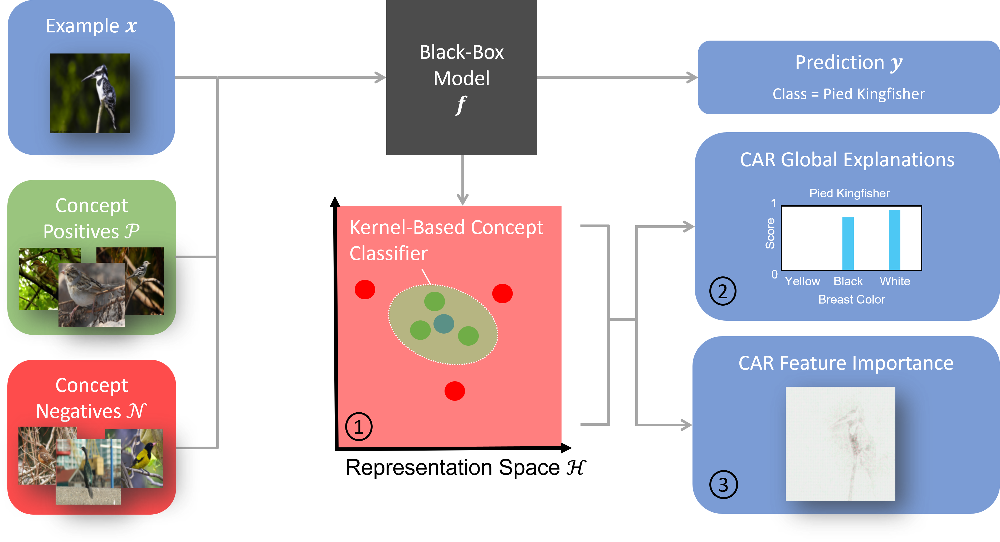

# Concept Activation Regions


Code Author: Jonathan Crabbé ([jc2133@cam.ac.uk](mailto:jc2133@cam.ac.uk))

This repository contains the implementation of CARs, a framework to explain the latent
representations of neural networks with the help of user-defined concepts.
For more details, please read our [NeurIPS 2022 paper](https://arxiv.org/abs/2209.11222): 'Concept Activation Regions: 
A Generalized Framework For Concept-Based Explanations'.

## 1. Installation
From repository:
1. Clone the repository
2. Create a new virtual environment with Python 3.9
3. Run the following command from the repository folder:

```shell
pip install -r requirements.txt
```

When the packages are installed, you are ready to perform concept explanations.

## 2. Toy example

Bellow, you can find a toy demonstration where we compute label-free feature and example importance
with a MNIST autoencoder. The relevant code can be found in the folder
[explanations](explanations).

```python
import torch
from torchvision.datasets import MNIST
from torchvision.transforms import transforms
from pathlib import Path
from utils.dataset import generate_mnist_concept_dataset
from models.mnist import ClassifierMnist
from experiments.mnist import concept_to_class
from explanations.concept import CAR
from explanations.feature import CARFeatureImportance

device = torch.device("cuda") if torch.cuda.is_available() else torch.device("cpu")
data_dir = Path.cwd()/"data/mnist"

# Load model
model = ClassifierMnist(latent_dim=42).to(device)

# Load concept sets
X_train, C_train = generate_mnist_concept_dataset(concept_to_class["Loop"],
                                               data_dir,
                                               train=True,
                                               subset_size=200, 
                                               random_seed=42)
X_test, C_test = generate_mnist_concept_dataset(concept_to_class["Loop"],
                                               data_dir,
                                               train=False,
                                               subset_size=100, 
                                               random_seed=42)

# Evaluate latent representation
X_train = torch.from_numpy(X_train).to(device)
X_test = torch.from_numpy(X_test).to(device)
H_train = model.input_to_representation(X_train)
H_test = model.input_to_representation(X_test)

# Fit CAR classifier
car = CAR(device)
car.fit(H_train.detach().cpu().numpy(), C_train)
car.tune_kernel_width(H_train.detach().cpu().numpy(), C_train)

# Predict concept labels
C_predict = car.predict(H_test.detach().cpu().numpy())

# Load test set
test_set = MNIST(data_dir, train=False, download=True)
test_set.transform = transforms.Compose([transforms.ToTensor()])
test_loader = torch.utils.data.DataLoader(test_set, batch_size=100, shuffle=False)

# Evaluate feature importance on the test set
baselines = torch.zeros([1, 1, 28, 28]) # Black image baseline
car_features = CARFeatureImportance("Integrated Gradient", car, model, device)
feature_importance = car_features.attribute(test_loader, baselines=baselines)
```


## 3. Reproducing the paper results

### MNIST Dataset
Run the following script
```shell
python -m experiments.mnist --name experiment_name --train --plot
```
where the --train option should only be used one time to fit a model for all the experiments.
The experiment_name parameter can take the following values:

| experiment_name          | description                                                       |
|--------------------------|-------------------------------------------------------------------|
| concept_accuracy         | Consistency check for CAR classifiers (paper Section 3.1.1)       |
| statistical_significance | Statistical significance for the concepts (paper Section 3.1.1)   |
| global_explanations      | Consistency check for TCAR explanations (paper Section 3.1.2)     |
| feature_importance       | Consistency check for  feature importance (paper Section 3.1.3)   |
| kernel_sensitivity       | Kernel sensitivity experiment (paper Appendix A)                  |
| concept_size_impact      | Impact of concept set size (paper Appendix A)                     |
| tcar_inter_concepts       | Intersection between concepts (paper Appendix B)                  |
| adversarial_robustness   | Robustness w.r.t. adversarial perturbation (paper Appendix G)     |
| senn                     | Experiment with self-explaining neural network (paper Appendix H) |

The resulting plots and data are saved [here](results/mnist).

### ECG Dataset
Our script automatically downloads the ECG dataset from Kaggle. To do so, one has
to create a Kaggle token as explained [here](https://towardsdatascience.com/downloading-datasets-from-kaggle-for-your-ml-project-b9120d405ea4).
Once the token is properly set-up, one can run our experiments with the script
```shell
python -m experiments.ecg --name experiment_name --train --plot
```
where the --train option should only be used one time to fit a model for all the experiments.
The experiment_name parameter can take the following values:

| experiment_name          | description                                                     |
|--------------------------|-----------------------------------------------------------------|
| concept_accuracy         | Consistency check for CAR classifiers (paper Section 3.1.1)     |
| statistical_significance | Statistical significance for the concepts (paper Section 3.1.1) |
| global_explanations      | Consistency check for TCAR explanations (paper Section 3.1.2)   |
| feature_importance       | Consistency check for  feature importance (paper Section 3.1.3) |


The resulting plots and data are saved [here](results/ecg).

### CUB Dataset

1. Create a folder [data/cub](data/cub) in the repo folder.

2. Download the [CUB dataset](https://worksheets.codalab.org/bundles/0xd013a7ba2e88481bbc07e787f73109f5), 
the [processed CUB dataset](https://worksheets.codalab.org/bundles/0x5b9d528d2101418b87212db92fea6683)
and the [Place365 dataset](https://worksheets.codalab.org/bundles/0x82cbec1d9dd8464fa67c4afa2bfeceba).

3. Extract the two downloaded archives in the created folder [data/cub](data/cub)

4. Process the CUB dataset for the robustness experiment with the script  
```shell
python -m utils.robustness
```

Once the dataset has been processed, one can run our experiments with the script
```shell
python -m experiments.cub --name experiment_name --train --plot
```
where the --train option should only be used one time to fit a model for all the experiments.
The experiment_name parameter can take the following values:

| experiment_name                | description                                                     |
|--------------------------------|-----------------------------------------------------------------|
| concept_accuracy               | Consistency check for CAR classifiers (paper Section 3.1.1)     |
| statistical_significance       | Statistical significance for the concepts (paper Section 3.1.1) |
| global_explanations            | Consistency check for TCAR explanations (paper Section 3.1.2)   |
| feature_importance             | Consistency check for  feature importance (paper Section 3.1.3) |
| tune_kernel                    | Kernel optimization experiment (paper Appendix A)               |
| global_explanations_robustness | Robustness w.r.t. background shift (paper Appendix G)           |

The resulting plots and data are saved [here](results/cub).

### SEER Dataset

1. Create a folder [data/seer](data/seer) in the repo folder.

2. Get the raw [SEER Dataset](https://seer.cancer.gov/data-software/) in the form of a csv file ``seer.csv``.

3. Put the file ``seer.csv`` in the folder [data/seer](data/seer).

Once the dataset has been processed, one can run our experiments with the script
```shell
python -m experiments.seer --name experiment_name --train --plot
```
where the --train option should only be used one time to fit a model for all the experiments.
The experiment_name parameter can take the following values:

| experiment_name                | description                                  |
|--------------------------------|----------------------------------------------|
| concept_accuracy               | Prostate cancer use case (paper Section 3.2) |
| global_explanations            | Prostate cancer use case (paper Section 3.2) |
| feature_importance             | Prostate cancer use case (paper Section 3.2) |

The resulting plots and data are saved [here](results/seer).


## 4. Citing

If you use this code, please cite the associated paper:

```
@misc{https://doi.org/10.48550/arxiv.2209.11222,
  doi = {10.48550/ARXIV.2209.11222},
  url = {https://arxiv.org/abs/2209.11222},
  author = {Crabbé, Jonathan and van der Schaar, Mihaela},
  keywords = {Machine Learning (cs.LG), Artificial Intelligence (cs.AI), FOS: Computer and information sciences, FOS: Computer and information sciences},
  title = {Concept Activation Regions: A Generalized Framework For Concept-Based Explanations},
  publisher = {arXiv},
  year = {2022},
  copyright = {Creative Commons Attribution 4.0 International}
}
```


